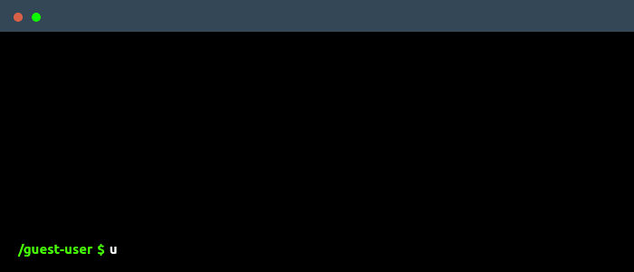

<div align="center">



</div>

<div align="center">

[](mailto:contact@giovannideveloper.com)
[](https://www.linkedin.com/in/giovannideveloper)
[]( https://www.instagram.com/giovannideveloper)
[](https://www.tiktok.com/@giovannideveloper)
[](https://www.youtube.com/@giovannideveloper)


</div>

```javascript
const giovanni = {
  pronouns: "he" | "him",
  age: 23,
  code: ["HTML", "CSS", "JavaScript"],
  tools: ["React", "Node", "ExpressJS", "Vite", "JWT"],
  databases: ["MySQL", "MongoDB"]
};
```


<p style="animation: fadein 2s; font-size: medium;font-family: 'IBM Plex Mono', monospace;">
Hey there! 👋 I'm Giovanni, a web developer passionate about creating new things. I've shared some interesting projects, so make sure to check them out on my GitHub profile 👌.<br/><br/>
-💻 I dedicate my free time to building and developing applications and websites because I love to keep growing and perfecting my skills 😄.<br/><br/>
-📚 Right now, my main focus is on learning everything about web development, from front-end technologies to back-end intricacies.<br/><br/>
-🤝 I'm always excited to collaborate with others and contribute to various projects. If you have a project that needs an extra hand or new ideas, feel free to contact me!
</p>


