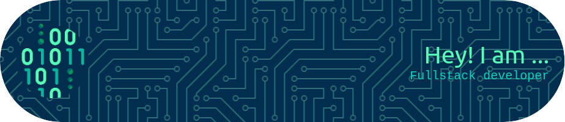

# Welcome to my Github

 

"Soy un programador web de 22 años apasionado por la creación de experiencias digitales únicas y funcionales. Con sólidos conocimientos en desarrollo front-end y back-end, disfruto trabajando en proyectos que desafían mis habilidades y me permiten explorar nuevas tecnologías. Comprometido con el aprendizaje continuo, estoy siempre buscando mejorar mis habilidades y contribuir al mundo digital con soluciones innovadoras y eficientes."

