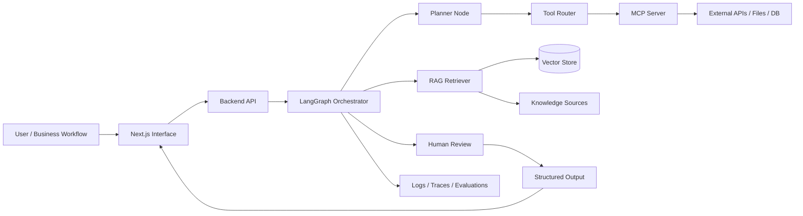

```text
+==================================================================================+
|                                                                                  |
|   G I O V A N N I   R O M E R O                                                  |
|                                                                                  |
|   FULL STACK DEVELOPER  //  AI ENGINEER                                          |
|                                                                                  |
|   LANGGRAPH | MCP | LANGCHAIN | RAG | AI AGENTS | AUTOMATION | FULL-STACK AI      |
|                                                                                  |
+==================================================================================+
```

```console
giovanniromero@dev:~$ whoami
Full Stack Developer & AI Engineer · Building AI Agents & Agentic Systems ·
Cybersecurity Enthusiast.

giovanniromero@dev:~$ current_focus
> LangGraph state machines
> MCP servers and tool integrations
> LangChain / LCEL workflows
> RAG and knowledge assistants
> Full-stack AI products with APIs, dashboards, auth, databases, and deployment
> Security-aware boundaries for tools, data, permissions, logs, and secrets
```

## ./agent_graph


```mermaid
flowchart LR
    U[User / Business Workflow] --> UI[Next.js Interface]
    UI --> API[Backend API]
    API --> LG[LangGraph Orchestrator]

    LG --> PLAN[Planner Node]
    PLAN --> TOOLS[Tool Router]
    TOOLS --> MCP[MCP Server]
    MCP --> EXT[External APIs / Files / DB]

    LG --> RAG[RAG Retriever]
    RAG --> VDB[(Vector Store)]
    RAG --> DOCS[Knowledge Sources]

    LG --> REVIEW[Human Review]
    REVIEW --> OUT[Structured Output]
    OUT --> UI

    LG --> LOGS[Logs / Traces / Evaluations]
```

## ./mcp_manifest.json

```json
{
  "profile": "Full Stack Developer & AI Engineer",
  "positioning": "Building AI Agents & Agentic Systems",
  "core_protocols": ["MCP", "LangGraph", "LangChain", "RAG"],
  "agent_patterns": [
    "tool calling",
    "stateful workflows",
    "human-in-the-loop review",
    "retrieval-augmented generation",
    "workflow automation",
    "structured outputs"
  ],
  "delivery": [
    "frontend interface",
    "backend API",
    "database model",
    "agent orchestration",
    "tool boundary design",
    "deployment notes"
  ],
  "security_mindset": [
    "auth boundaries",
    "least privilege tools",
    "secret handling",
    "audit logs",
    "safe API integration"
  ]
}
```

## ./build_matrix

| Layer | Tools | What I Build |
|---|---|---|
| Agent Orchestration | LangGraph, LangChain, LCEL | Multi-step agents, state graphs, routers, retries, review loops |
| Tool Protocol | MCP | Tool schemas, MCP servers, connector boundaries, safe tool execution |
| Knowledge | RAG, embeddings, vector stores | Knowledge assistants, grounded answers, source-aware workflows |
| Product | Next.js, React, TypeScript | Interfaces, dashboards, admin panels, user workflows |
| Backend | Node.js, Express, FastAPI | APIs, integrations, auth flows, webhooks, automation services |
| Data | MongoDB, PostgreSQL, SQL | Persistence, run history, structured outputs, reporting |
| Automation | Playwright, APIs, scheduled jobs | Research agents, content workflows, business process automation |
| Security-Aware Engineering | Auth, logs, secrets, validation | Safer boundaries around data, users, tools, and external APIs |

## ./services_vector

```text
ai_agent_development             -> scoped agent workflows, tools, memory/state, handoff
mcp_server_tool_integration      -> MCP servers, tool schemas, permissions, API connectors
langgraph_workflow_builds        -> graph nodes, routing, retries, human review, observability
langchain_lcel_automation        -> chains, structured outputs, model/tool pipelines
rag_knowledge_assistants         -> ingestion, retrieval, grounded answers, source traceability
full_stack_ai_features           -> UI, API, database, auth, deployment, documentation
business_automation              -> repeatable workflows, integrations, dashboards, reports
security_aware_implementation    -> auth boundaries, secrets, logs, validation, safe APIs
```

## ./featured_work

```console
giovanniromero@dev:~$ ls ~/repos --focus agentic-ai
```

| Priority | Repository | Why it matters for this profile |
|---:|---|---|
| 01 | [langgraph-foundations](https://github.com/giovanniromero-dev/langgraph-foundations) | Most aligned with the new profile: LangGraph agents, ReAct patterns, tool orchestration, streaming, debugging, and graph-based control flow. |
| 02 | [osint-agent](https://github.com/giovanniromero-dev/osint-agent) | Practical agentic automation: LangGraph, DeepSeek, Playwright, public-source data collection, tool use, and structured reports. |
| 03 | [lcel-llm-translator](https://github.com/giovanniromero-dev/lcel-llm-translator) | LangChain / LCEL workflow showing structured language processing, LangServe patterns, and LLM pipeline design. |
| 04 | [network-operations-center](https://github.com/giovanniromero-dev/network-operations-center) | Strong full-stack product signal: TypeScript platform, dashboards, alerts, operational visibility, and API-driven workflows. |
| 05 | [github-discord-webhook-notifier](https://github.com/giovanniromero-dev/github-discord-webhook-notifier) | Backend/API integration signal: signed webhooks, event routing, Discord notifications, and security-aware API boundaries. |
| 06 | [airplane-tracking-with-yolov8](https://github.com/giovanniromero-dev/airplane-tracking-with-yolov8) | AI engineering support signal: computer vision prototype for object detection, tracking, and visual intelligence workflows. |

## ./agentic_system_design

```text
1. define_scope
   - user goal
   - tool permissions
   - data boundaries
   - expected output

2. design_graph
   - nodes
   - edges
   - state
   - retry paths
   - review checkpoints

3. connect_tools
   - MCP server or direct API connector
   - schema validation
   - error handling
   - logs and traces

4. build_product_layer
   - UI
   - backend API
   - database
   - auth
   - admin controls

5. ship_iteration
   - test cases
   - usage docs
   - deployment notes
   - next-step roadmap
```

## ./learning_now

```text
[COURSE] Complete MCP Bootcamp: Build Next-Gen AI Agents with MCP
[COURSE] Complete Agentic AI Bootcamp with LangGraph and LangChain
[FOCUS]  MCP server architecture, tool schemas, agent orchestration, RAG, evaluations
[GOAL]   Build useful AI systems that connect tools, data, APIs, and product interfaces
```

## ./contact

```console
giovanniromero@dev:~$ ./connect --target professional
site      : https://giovanniromero.dev
linkedin  : https://www.linkedin.com/in/giovannideveloper/
x         : https://x.com/giovanni_dev_
email     : contact@giovanniromero.dev
```

```console
giovanniromero@dev:~$ _
```