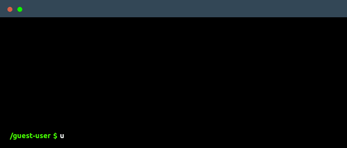

```
╔════════════════════════════════════════════════════════════╗
║                                                            ║
║                      GIOVANNI ROMERO                       ║
║          Software Engineer | AI Systems Architect          ║
║                                                            ║
╚════════════════════════════════════════════════════════════╝
```

<p align="center">
  
</p>

```
┌─────────────────────────────────────────────────────────┐
│ [1] WEBSITE    ->  giovanniromero.dev                   │
│ [2] LINKEDIN   ->  linkedin.com/in/giovanniromero-dev   │
│ [3] EMAIL      ->  contact@giovanniromero.dev           │
└─────────────────────────────────────────────────────────┘
```

<p align="center">
  <a href="https://giovanniromero.dev"><sup>[1] WEBSITE</sup></a> ·
  <a href="https://www.linkedin.com/in/giovanniromero-dev/"><sup>[2] LINKEDIN</sup></a> ·
  <a href="mailto:contact@giovanniromero.dev"><sup>[3] EMAIL</sup></a>
</p>

---

```
$ whoami
─────────────────────────────────────────────────────────────
  Engineer building production-grade AI architectures.
  Agentic workflows · LLM backends · Distributed systems · CV
```

---

```
$ cat ~/stack.json
─────────────────────────────────────────────────────────────
```

<p align="center">
  
</p>

```
  langs:      Python · TypeScript · JavaScript
  agents:     LangGraph · LangChain · MCP · Multi-Agent
  ai/ml:      TensorFlow · YOLOv8 · OpenCV · FAISS · Streamlit
  backend:    FastAPI · Node.js · Express · LangServe · REST · WebSocket
  frontend:   React · Angular · Vite
  data:       PostgreSQL · MongoDB · Prisma · Firebase
  infra:      Docker · GitHub Actions
```

---

```
$ ls ~/projects/
─────────────────────────────────────────────────────────────
```

<details>
<summary><code>agentic-chatbot/</code> — multi-agent reasoning system</summary>

```
  tools:  LangChain · LangGraph · FAISS · Tavily · Streamlit
  └─ https://github.com/giovanniromero-dev/agentic-chatbot
```
</details>

<details>
<summary><code>clinisight-ai/</code> — AI medical insight engine</summary>

```
  stack:  FastAPI · MCP · OpenAI · PubMed
  └─ https://github.com/giovanniromero-dev/clinisight-ai
```
</details>

<details>
<summary><code>network-operations-center/</code> — enterprise monitoring system</summary>

```
  stack:  TypeScript · Prisma · Docker · PostgreSQL / MongoDB
  └─ https://github.com/giovanniromero-dev/network-operations-center
```
</details>

<details>
<summary><code>lcel-llm-translator/</code> — production LLM translation pipeline</summary>

```
  stack:  LangChain LCEL · Groq LLaMA · FastAPI · LangServe
  └─ https://github.com/giovanniromero-dev/lcel-llm-translator
```
</details>

<details>
<summary><code>airplane-tracking-with-yolov8/</code> — real-time object detection</summary>

```
  stack:  YOLOv8 · OpenCV · trajectory tracking
  └─ https://github.com/giovanniromero-dev/airplane-tracking-with-yolov8
```
</details>

<details>
<summary><code>restful-api-for-article-management/</code> — content management API</summary>

```
  stack:  Node.js · Express · MongoDB · Multer
  └─ https://github.com/giovanniromero-dev/restful-api-for-article-management
```
</details>

---

```
$ neofetch
─────────────────────────────────────────────────────────────
```

<div align="center">
  
  
</div>

```
  status:     online
  focus:      shipping AI agents & backend systems
  deploys:    10+ production systems
  repos:      20+ public projects
```

---

<p align="center">
  <code>root@giovanniromero ~ $ █</code>
</p>
